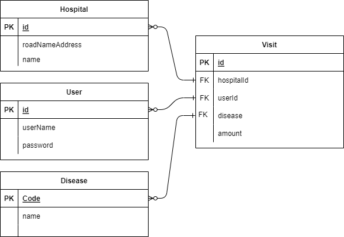

# 전국 병·의원 데이터 웹 페이지 만들기
## ERD

## 기술 스택 및 배포 주소
`Java 11`· `Spring Boot 2.7.5`· `Spring Security`· `Jdbc`· `JPA`· `MySQL 8.0`·`AWS`· `Docker`
접속주소:
ec2-3-38-172-197.ap-northeast-2.compute.amazonaws.com:8080/api/v1/reviews/{id}
ec2-3-38-172-197.ap-northeast-2.compute.amazonaws.com:8080/api/v1/hospitals/{id}
## 병·의원 데이터 정보 및 라이브러리
데이터 출처 : https://www.localdata.go.kr/devcenter/dataDown.do?menuNo=20001
병원 데이터와 의원 데이터 결합, 총 121,005개의 데이터 (병원 6992개 + 의원 114013개)
데이터 형식 에러 튜플 2개 제외, 총 121003개 데이터
- Gradle 빌드
  ```
  dependencies {
  implementation 'org.springframework.boot:spring-boot-starter-data-jpa'
  implementation 'org.springframework.boot:spring-boot-starter-mustache'
  implementation 'org.springframework.boot:spring-boot-starter-web'
  implementation 'com.mysql:mysql-connector-j:8.0.31'
  implementation 'com.github.gavlyukovskiy:p6spy-spring-boot-starter:1.8.1'
  implementation 'com.google.code.gson:gson:2.10'
  compileOnly 'org.projectlombok:lombok'
  annotationProcessor 'org.springframework.boot:spring-boot-configuration-processor'
  annotationProcessor 'org.projectlombok:lombok'
  testImplementation 'org.springframework.boot:spring-boot-starter-test'

  //security 관련 라이브러리
  implementation 'org.springframework.security:spring-security-test'
  implementation group: 'io.jsonwebtoken', name: 'jjwt', version: '0.9.1'
  implementation group: 'org.springframework.boot', name: 'spring-boot-starter-security', version: '2.7.5'

}
```
### 프로젝트 소개

## REST API
### 병원 리뷰 생성기능 && 특정 병원의 리뷰를 조회하는 기능
| 구분 | 기능 | METHOD | API |
| --- | --- | --- | --- |
| 병원 리뷰 생성 | 리뷰 생성 | POST | /api/v1/hospitals/{id}/reviews |
| 병원 리뷰 조회 | 리뷰 1개 조회 기능 | GET | /api/v1/reviews/{id} |
| 병원 리뷰 조회 | 해당 병원의 리뷰만 모두 조회 | GET | /api/v1/hospitals/{id}/reviews |
| 병원 리뷰 조회 | 병원 정보와 함께 리뷰 조회 | GET | /api/v1/hospitals/{id} |

